# LexiAI

> **Advanced Legal AI Assistant for contract analysis, comparison, and grounded Q&A.**

## Overview

LexiAI is a modular legal AI platform designed to ingest contracts, extract structured legal intelligence, compare agreements clause-by-clause, and answer questions with strong context grounding. The system combines document AI, legal NLP, local LLM inference, and retrieval-augmented generation into a single workflow that supports contract review, risk assessment, comparison, and executive reporting.

The architecture is intentionally local-first: scanned and digital documents are processed through a routing layer, legal features are extracted into structured artifacts, and the RAG stack uses a vector database plus reranking to keep answers anchored to the source contract content. This makes the platform suitable for privacy-sensitive legal workflows and iterative contract analysis.

## System Architecture

```mermaid
flowchart LR
	A[Document Ingestion] --> B{Document Type}
	B -->|Native PDF with sufficient text| C[PyMuPDF Extraction]
	B -->|Scanned PDF / image| D[OCR Routing]
	D --> D1[Image Preprocessing]
	D1 --> D2[EasyOCR]
	C --> E[Text Cleaning & Page Structuring]
	D2 --> E
	E --> F[Legal NLP & Clause / Entity Extraction]
	F --> G[Contract Comparison & Risk Analysis]
	F --> H[Embedding + Chunking Pipeline]
	H --> I[Qdrant Vector Store]
	I --> J[Query Rewriting + Multi-Query Retrieval]
	J --> K[Cross-Encoder Re-Ranking]
	K --> L[Context Builder]
	L --> M[qwen2.5:3b-instruct via Ollama]
	G --> N[Structured Comparison Output]
	M --> O[Grounded Answer / Report]
	O --> P[JSON + Markdown Delivery]
```

## Core Modules

### Document AI: Ingestion & OCR

The Document AI layer is built around a routing pipeline that chooses the cheapest reliable extraction path for each file.

- Native PDFs are processed with PyMuPDF (`fitz`) first.
- The router evaluates the extracted text length and falls back to OCR when the document looks scanned or text-poor.
- The current routing threshold is 20 characters, which acts as a fast quality gate for deciding whether page text is usable.
- OCR is handled through EasyOCR, with image preprocessing and page rendering used to improve recognition quality.
- PDF pages that fail text extraction are rendered to images and OCR'd page-by-page so the output remains page aware.

This design keeps digital PDFs fast while still supporting scanned documents and image-based legal artifacts.

### Legal NLP & Contract Analysis

LexiAI’s legal NLP stack turns raw contracts into structured, reviewable legal intelligence.

- Clause and entity extraction produces a normalized representation that downstream modules can consume.
- Contract comparison is powered locally through `qwen2.5:1.5b-instruct` via Ollama.
- The comparison prompt is explicitly framed from a buyer-risk perspective, which makes the output useful for procurement, legal ops, and vendor review.
- Each clause is analyzed side-by-side, and the model returns a winner per feature along with a concise explanation.
- Risk analysis is derived from the contract text and used to support both comparison and reporting.

The intent here is not generic summarization. The system is tuned for legal decision support: what changes, who benefits, where exposure increases, and which clause is safer from the buyer’s point of view.

### LLM Assistant: Report Generation

The LLM Assistant module turns extracted contract intelligence into stakeholder-ready reports.

- LangChain orchestrates the multi-step prompt chain.
- The pipeline first extracts metadata, then builds executive content, then assembles sectioned output.
- The generated artifact includes structured JSON and Markdown-oriented report content.
- Output sections include Executive Summary, KPI cards, Key Findings, Important Clauses, Risk Analysis, and Recommendations.
- The local `qwen2.5:1.5b-instruct` model is used for controlled, deterministic report drafting.

This module is designed to bridge the gap between legal analysis and business communication.

### RAG System: Retrieval-Augmented Generation

The RAG stack is optimized for contract-grounded answers rather than broad general-purpose chat.

- Qdrant stores embedded contract chunks and metadata for retrieval.
- `sentence-transformers/all-MiniLM-L6-v2` powers dense embeddings.
- Query rewriting and multi-query generation improve recall on user questions with ambiguous wording.
- Cross-encoder reranking uses `cross-encoder/ms-marco-MiniLM-L6-v2` to improve ranking quality before response generation.
- `qwen2.5:3b-instruct` generates final responses from the selected context only.
- The pipeline is engineered to keep answers strictly grounded in the retrieved contract context.

The result is a high-precision legal Q&A experience that favors evidence-backed answers over speculative language.

## Future Work / Roadmap

- Upgrade OCR to page-level hybrid routing with stronger engines such as PaddleOCR or TrOCR.
- Expand the legal dataset to improve extraction, comparison, and retrieval quality across more contract families.
- Add more fine-grained clause templates and jurisdiction-aware evaluation strategies.
- Improve hybrid-document handling so mixed native/scanned PDFs can route different pages independently.

## Project Notes

LexiAI is organized as a multi-layer system with backend APIs, AI modules, document processing utilities, and a separate frontend application. The current codebase emphasizes local inference, structured outputs, and modular AI services so each pipeline can evolve independently.

If you want, I can also turn this into a fuller open-source README with sections for Features, API overview, Project Structure, Environment Setup, and Usage examples while keeping the same technical style.
