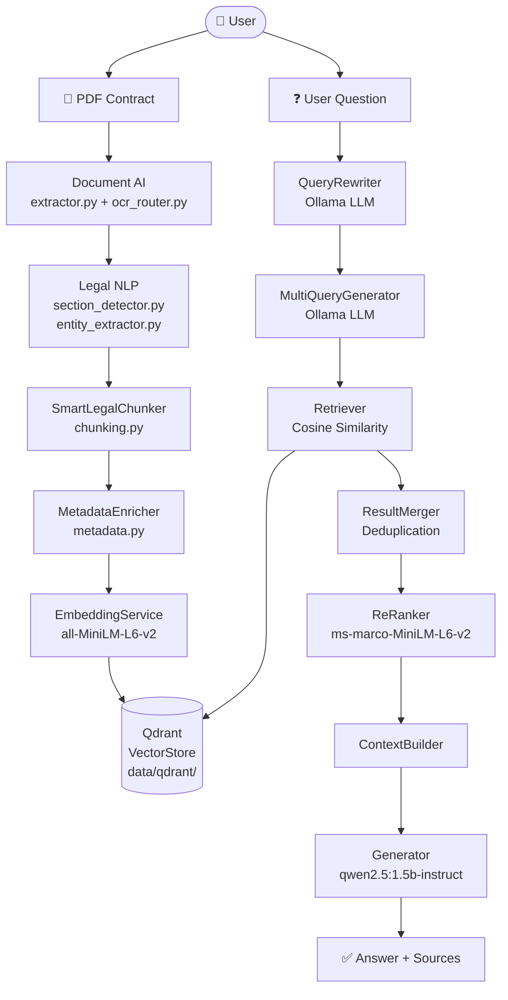
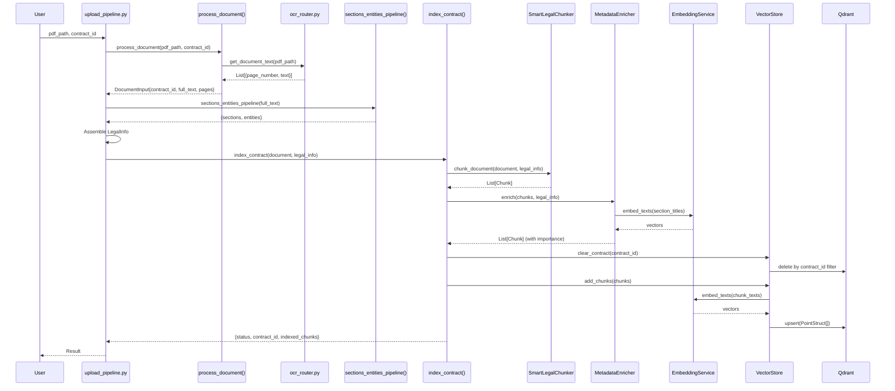
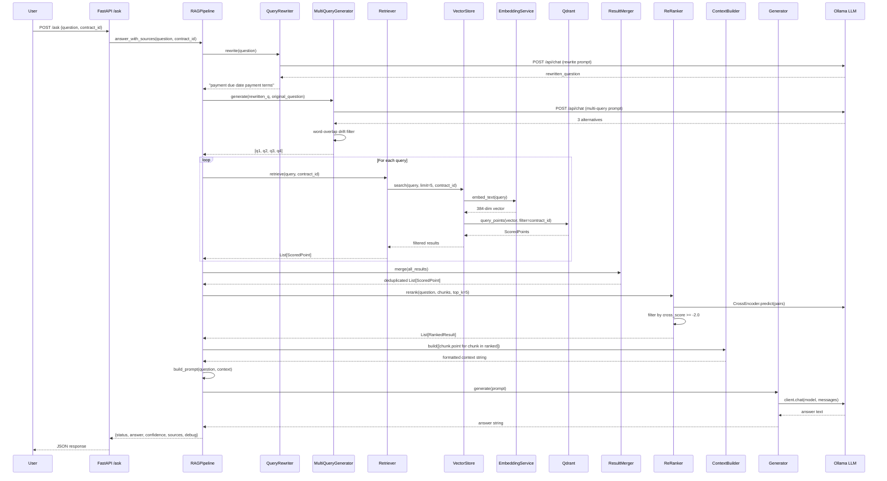

# LexiAI — Software Architecture Document (SAD)
### Complete Technical Audit & Architecture Reference
**Version:** 1.0 | **Date:** 2026-07-28 | **Prepared by:** Technical Audit

---

## Table of Contents

1. [System Understanding](#part-1)
2. [End-to-End Flow](#part-2)
3. [File-by-File Analysis](#part-3)
4. [RAG Architecture Layers](#part-4)
5. [Architecture Diagrams](#part-5)
6. [Feature Checklist](#part-6)
7. [Problems & Weak Points](#part-7)
8. [System Evaluation Scores](#part-8)
9. [Current Capabilities](#part-9)
10. [Production Readiness](#part-10)

---

## PART 1 — System Understanding {#part-1}

### What Problem Does This System Solve?

LexiAI solves the problem of **intelligent, grounded question-answering over legal contracts**. Traditional keyword search cannot understand legal intent or cross-reference related clauses across a document. LexiAI enables a user to upload a legal PDF contract and ask natural-language questions like:

- *"What is the payment period?"*
- *"What are the termination rights of the parties?"*
- *"What is the penalty for late delivery?"*

...and receive **accurate, cited answers** backed by the actual text in the contract, with **zero hallucination** because the LLM is constrained strictly to the retrieved contract context.

### Main Use Case

| Scenario | Description |
|---|---|
| **Contract Review** | Lawyers or business analysts upload a contract PDF and ask natural-language questions |
| **Clause Extraction** | Extract specific clauses (payment, termination, liability) automatically |
| **Risk Identification** | Find risky or missing clauses without reading the full document |
| **Multi-Contract Analysis** | Index multiple contracts and query each independently by contract_id |

### RAG Architecture Type

This system implements **Advanced Multi-Stage RAG**:

| Stage | Implementation |
|---|---|
| Query Rewriting | Ollama LLM (Qwen2.5:1.5b-instruct) |
| Multi-Query Expansion | Ollama LLM generating synonym alternatives |
| Dense Retrieval | Qdrant local vector store (cosine similarity) |
| Bi-encoder Embedding | SentenceTransformer `all-MiniLM-L6-v2` |
| Similarity Filtering | Configurable threshold (default: 0.20) |
| Reranking | CrossEncoder `ms-marco-MiniLM-L6-v2` |
| Context Building | Formatted chunk assembly |
| Generation | Ollama LLM (Qwen2.5:1.5b-instruct) |

### How Legal Contracts Are Processed and Queried

**Indexing Time:**
1. PDF is extracted page-by-page using PyMuPDF (with Tesseract OCR fallback)
2. Full text is passed through Legal NLP: section classification and entity extraction
3. Document is chunked section-by-section with overlap (1200 char max, 250 char overlap)
4. Each chunk is enriched with metadata: contract_id, page, section, importance score
5. Chunks are embedded and stored in Qdrant with payload metadata

**Query Time:**
1. User question is rewritten to a cleaner legal synonym form
2. Multiple alternative queries are generated
3. Each query retrieves top-5 chunks from Qdrant, filtered to the specific contract_id
4. All results are merged and deduplicated
5. A CrossEncoder reranks results by true semantic relevance
6. Top-ranked chunks are formatted as context and passed to the LLM
7. LLM answers strictly from context, citing clause, section, and page

---

## PART 2 — Complete End-to-End Flow {#part-2}

### A) PDF Upload Flow

```
User provides PDF path
      ↓
backend/upload_pipeline.py → upload_pipeline()
      ↓
ai_modules/document_ai/pipeline.py → process_document()
      ↓
ai_modules/document_ai/extractor.py → extract_pages()     [PyMuPDF native]
      ↓  (fallback if text < 20 chars)
ai_modules/document_ai/ocr/ocr_router.py → _ocr_pdf_pages()   [Tesseract]
      ↓
Returns: DocumentInput { contract_id, full_text, pages: [Page] }
      ↓
ai_modules/legal_nlp/pipeline.py → sections_entities_pipeline()
      ↓
  legal_nlp/preprocessing.py → clean_text(), split_sentences()
      ↓
  legal_nlp/section_detector.py → find_sections()         [keyword matching]
  legal_nlp/entity_extractor.py → extract_entities()      [GLiNER / regex]
      ↓
Returns: { sections: [...], entities: [...] }
      ↓
Assembles: LegalInfo { sections: [Section], entities: [Entity] }
      ↓
ai_modules/rag_system/index_service.py → index_contract()
      ↓
  rag_system/chunking.py → SmartLegalChunker.chunk_document()
      ↓  (prefers sections, falls back to pages)
  SmartLegalChunker.chunk_sections() OR chunk_pages()
      ↓
Returns: List[Chunk]  { chunk_id, contract_id, page, section, text, ... }
      ↓
  rag_system/metadata.py → MetadataEnricher.enrich()
      ↓  (cosine similarity vs section titles to compute importance)
Returns: List[Chunk]  (with importance scores filled)
      ↓
  vector_store.clear_contract(contract_id)     [purge old data FIRST]
      ↓
  rag_system/vector_store.py → VectorStore.add_chunks()
      ↓
  rag_system/embedding_service.py → EmbeddingService.embed_texts()
      ↓  (SentenceTransformer all-MiniLM-L6-v2, batch 32)
Returns: numpy arrays (384-dim vectors)
      ↓
  QdrantClient.upsert() → data/qdrant/ (local file storage)
      ↓
Indexed ✅
```

**Data Structures at Each Step:**

| Step | Input | Output |
|---|---|---|
| `process_document()` | PDF path, contract_id: int | `DocumentInput` (full_text, pages) |
| `extract_pages()` | PDF path | `List[{page_number, text}]` |
| `sections_entities_pipeline()` | full_text: str | `{sections, entities}` dict |
| `find_sections()` | List[str] sentences | `List[{type, text}]` |
| `extract_entities()` | full_text: str | `List[{type, value}]` |
| `chunk_document()` | DocumentInput, LegalInfo | `List[Chunk]` |
| `enrich()` | List[Chunk], LegalInfo | `List[Chunk]` (with importance) |
| `add_chunks()` | List[Chunk] | Qdrant `upsert()` call |

**Possible Failures at Each Step:**

| Step | Failure | Effect |
|---|---|---|
| `extract_pages()` | Scanned/image PDF with no extractable text | Falls back to OCR |
| OCR | Tesseract not installed or bad image quality | `RuntimeError` |
| `sections_entities_pipeline()` | GLiNER not installed | Falls back to regex |
| `find_sections()` | No legal keywords matched | Returns `[]` → chunker uses pages |
| `chunk_document()` | No sections and no pages | Returns `[]` |
| `EmbeddingService` | HuggingFace unreachable offline | `ConnectionError` on first load |
| `VectorStore.add_chunks()` | Qdrant file lock from another process | `StorageLockError` |

---

### B) Question Answering Flow

```
User sends: { question, contract_id (optional) }
      ↓
ai_modules/rag_system/api.py → POST /ask or /chat
      ↓
rag_system/rag_pipeline.py → RAGPipeline.answer_with_sources()
      ↓
RAGPipeline._run_pipeline(question, contract_id)
      ↓
── QUERY REWRITING ──────────────────────────────────────────────
rag_system/query_rewriter.py → QueryRewriter.rewrite()
  Input:  "What is the payment period?"
  Output: "payment due date payment terms"
  Model:  Ollama POST /api/chat  (Qwen2.5:1.5b-instruct)
  Fallback: Returns original question on any failure
──────────────────────────────────────────────────────────────────
      ↓
── MULTI-QUERY GENERATION ────────────────────────────────────────
rag_system/multi_query.py → MultiQueryGenerator.generate()
  Input:  rewritten_question + original_question (for drift filter)
  Output: ["payment due date payment terms",
           "payment deadline",
           "invoice payment",
           "payment obligation"]
  Filter: word-overlap with ORIGINAL question prevents drift
──────────────────────────────────────────────────────────────────
      ↓
── DENSE RETRIEVAL (per query) ───────────────────────────────────
rag_system/retriever.py → Retriever.retrieve(query, contract_id)
  ↓
rag_system/vector_store.py → VectorStore.search(query, limit=5, contract_id)
  ↓
rag_system/embedding_service.py → EmbeddingService.embed_text(query)
  → 384-dim vector
  ↓
QdrantClient.query_points() with:
  - cosine similarity
  - Filter: FieldCondition(contract_id == contract_id)
  → Returns top-5 ScoredPoints
  ↓
Filter: score >= similarity_threshold (0.20)
──────────────────────────────────────────────────────────────────
      ↓
── RESULT MERGING ────────────────────────────────────────────────
rag_system/result_merger.py → ResultMerger.merge()
  Deduplicates across all query results by chunk_id
──────────────────────────────────────────────────────────────────
      ↓
── RERANKING ─────────────────────────────────────────────────────
rag_system/reranker.py → ReRanker.rerank()
  CrossEncoder: ms-marco-MiniLM-L6-v2
  Pairs: (question, chunk_text) for each candidate
  Scores: logit values (e.g. 2.56, -6.47, -7.46, ...)
  Filter: cross_score >= -2.0  (threshold)
  Sort:   descending by cross_score
  Kept:   top_k=5 passing threshold
──────────────────────────────────────────────────────────────────
      ↓
── CONTEXT BUILDING ──────────────────────────────────────────────
rag_system/context_builder.py → ContextBuilder.build()
  Formats chunks into:
  [Chunk 1]
  Chunk ID : 1_29
  Contract : 1
  Section  : Payment
  Page     : 4
  <text>
  ─────────────
  [Chunk 2] ...
──────────────────────────────────────────────────────────────────
      ↓
── PROMPT BUILDING ───────────────────────────────────────────────
rag_pipeline.py → RAGPipeline.build_prompt()
  Combines SYSTEM_PROMPT + USER_PROMPT_TEMPLATE{context, question}
──────────────────────────────────────────────────────────────────
      ↓
── LLM GENERATION ───────────────────────────────────────────────
rag_system/generator.py → Generator.generate()
  Ollama client.chat()
  Model: qwen2.5:1.5b-instruct
  Temperature: 0.2
  Max tokens: 512
  Validates model availability before calling
──────────────────────────────────────────────────────────────────
      ↓
── RESPONSE ASSEMBLY ─────────────────────────────────────────────
answer_with_sources() returns:
{
  "status": "success" | "not_found" | "error",
  "question": original question,
  "answer": LLM-generated text,
  "confidence": sigmoid(best_cross_score),
  "sources": [{ contract_id, section, page }],
  "debug": { processing_time, rewritten_query, generated_queries,
             retrieved_chunks, reranked_chunks, ... }
}
──────────────────────────────────────────────────────────────────
```

---

## PART 3 — File-by-File Analysis {#part-3}

### `ai_modules/rag_system/api.py`

| Field | Value |
|---|---|
| **Responsibility** | FastAPI entry point exposing HTTP endpoints |
| **Endpoints** | `GET /` health check, `POST /ask`, `POST /chat`, `POST /contracts/index` |
| **Key Classes** | `QuestionRequest`, `ChatRequest` (Pydantic request models) |
| **Dependencies** | FastAPI, RAGPipeline, index_contract, schemas |
| **Input** | HTTP JSON requests |
| **Output** | JSON responses with answer, sources, confidence |
| **Connects To** | `rag_pipeline.py`, `index_service.py`, `schemas.py` |
| **Production Readiness** | ⚠️ Missing auth, rate limiting, input validation |
| **Status** | ✅ Partially complete |

**Note:** `QuestionRequest` and `ChatRequest` both now support optional `contract_id` for scoped retrieval.

---

### `ai_modules/rag_system/services.py`

| Field | Value |
|---|---|
| **Responsibility** | Singleton shared instances to avoid multiple QdrantClient locks |
| **Key Instances** | `embedding_service`, `vector_store` |
| **Pattern** | Module-level singleton (Python module import cache) |
| **Input** | None (auto-initialized on import) |
| **Output** | Shared instances used across API, index_service, rag_pipeline |
| **Status** | ✅ Complete |

---

### `ai_modules/rag_system/index_service.py`

| Field | Value |
|---|---|
| **Responsibility** | Orchestrates the full indexing pipeline for a contract |
| **Key Function** | `index_contract(document, legal_info, vector_store=None)` |
| **Pipeline** | Chunk → Enrich → Clear old contract vectors → Add to Qdrant |
| **Failure Handling** | Wraps in try/except, returns `{status: "error", error: str}` |
| **Connects To** | `chunking.py`, `metadata.py`, `vector_store.py`, `services.py` |
| **Status** | ✅ Complete |

---

### `ai_modules/rag_system/chunking.py`

| Field | Value |
|---|---|
| **Responsibility** | Splits documents into semantically meaningful chunks |
| **Key Classes** | `SmartLegalChunker`, `Chunk` (dataclass), `ChunkingConfig` |
| **Strategy** | Section-aware (prefers legal sections), falls back to page-level |
| **Config** | max_chunk_chars=1200, min_chunk_chars=200, overlap_chars=250 |
| **Boundaries** | Tries `\n`, then `.`, then ` ` to avoid splitting mid-sentence |
| **Output** | `List[Chunk]` with chunk_id=`{contract_id}_{counter}` |
| **Status** | ✅ Complete |

**⚠️ Issue:** `optimize_chunks()` currently returns chunks unchanged (no merging or filtering logic implemented).

---

### `ai_modules/rag_system/metadata.py`

| Field | Value |
|---|---|
| **Responsibility** | Enriches chunks with importance scores using semantic similarity |
| **Key Class** | `MetadataEnricher` |
| **Method** | Embeds section titles and computes cosine similarity to chunk text |
| **Input** | `List[Chunk]`, `LegalInfo` |
| **Output** | `List[Chunk]` with `importance` field populated |
| **Status** | ✅ Complete |

---

### `ai_modules/rag_system/embedding_service.py`

| Field | Value |
|---|---|
| **Responsibility** | Converts text to dense 384-dim vectors |
| **Model** | `sentence-transformers/all-MiniLM-L6-v2` |
| **Key Methods** | `embed_text(text)`, `embed_texts(texts, batch_size=32)` |
| **Output** | `numpy.ndarray` (float32) |
| **Status** | ✅ Complete |

**⚠️ Issue:** First load requires internet/HuggingFace access. Must set `TRANSFORMERS_OFFLINE=1` in air-gapped environments.

---

### `ai_modules/rag_system/vector_store.py`

| Field | Value |
|---|---|
| **Responsibility** | Interface to Qdrant local vector database |
| **Key Methods** | `add_chunks()`, `search()`, `clear_contract()`, `delete_collection()`, `count()`, `get_all_chunks()` |
| **Storage** | `QdrantClient(path="data/qdrant")` — local file storage |
| **Collection** | `legal_contracts` (384-dim cosine distance) |
| **Filtering** | Supports Qdrant `Filter` with `FieldCondition(contract_id)` |
| **New in Fix** | `clear_contract(contract_id)` deletes only one contract's vectors |
| **Status** | ✅ Complete |

**⚠️ Issue:** Local Qdrant acquires a filesystem lock. Only one process can access at a time.

---

### `ai_modules/rag_system/retriever.py`

| Field | Value |
|---|---|
| **Responsibility** | Executes vector similarity search and applies threshold filtering |
| **Key Class** | `Retriever` |
| **Key Method** | `retrieve(question, top_k=None, contract_id=None)` |
| **Threshold** | `similarity_threshold = 0.20` |
| **Logging** | Detailed debug prints for before/after filtering with chunk_id and contract_id |
| **Status** | ✅ Complete |

---

### `ai_modules/rag_system/query_rewriter.py`

| Field | Value |
|---|---|
| **Responsibility** | Rewrites user question to cleaner, synonym-rich legal terms |
| **Key Class** | `QueryRewriter` |
| **Backend** | Ollama API: `POST /api/chat` with qwen2.5:1.5b-instruct |
| **Prompt Design** | Strict synonym-only rewriting, explicit prohibition of new concepts |
| **Fallback** | Returns original question on any failure |
| **Config** | `enable_query_rewrite: bool = True` |
| **Status** | ✅ Complete |

---

### `ai_modules/rag_system/multi_query.py`

| Field | Value |
|---|---|
| **Responsibility** | Generates multiple search queries from one rewritten query |
| **Key Method** | `generate(question, num_queries=3, original_question=None)` |
| **Backend** | Ollama LLM |
| **Drift Filter** | Word-overlap check anchored to `original_question`, not the rewrite |
| **Fallback** | Returns `[question]` if Ollama fails |
| **Status** | ✅ Complete |

---

### `ai_modules/rag_system/result_merger.py`

| Field | Value |
|---|---|
| **Responsibility** | Deduplicates results from multiple retrieval queries |
| **Strategy** | Keeps first occurrence of each `chunk_id` (highest-score first) |
| **Status** | ✅ Complete |

---

### `ai_modules/rag_system/reranker.py`

| Field | Value |
|---|---|
| **Responsibility** | Reranks retrieved chunks by true semantic relevance |
| **Model** | `cross-encoder/ms-marco-MiniLM-L6-v2` |
| **Input** | `(question, chunk_text)` pairs |
| **Output** | `List[RankedResult]` sorted by `cross_score` descending |
| **Threshold** | `cross_score_threshold = -2.0` (removes semantically irrelevant chunks) |
| **Debug Logs** | Before/after reranking with scores and rejection reasons |
| **Status** | ✅ Complete |

---

### `ai_modules/rag_system/context_builder.py`

| Field | Value |
|---|---|
| **Responsibility** | Assembles ranked chunks into a formatted context string |
| **Format** | `[Chunk N]\nChunk ID: ...\nContract: ...\nSection: ...\nPage: ...\n\n<text>` |
| **Separator** | `\n\n─────────────────\n\n` between chunks |
| **Status** | ✅ Complete |

---

### `ai_modules/rag_system/generator.py`

| Field | Value |
|---|---|
| **Responsibility** | Sends prompt to Ollama LLM and returns the answer |
| **Key Class** | `Generator` |
| **Backend** | `ollama.Client.chat()` |
| **Model** | `qwen2.5:1.5b-instruct` |
| **Settings** | temperature=0.2, max_tokens=512 |
| **Model Validation** | Checks available models before each call |
| **Fallback** | Returns error message string on failure |
| **Status** | ✅ Complete |

**⚠️ Issue:** `response.get("message", {}).get("content", "")` — this dict-style access breaks with newer `ollama` library versions that return typed objects instead of dicts.

---

### `ai_modules/rag_system/rag_pipeline.py`

| Field | Value |
|---|---|
| **Responsibility** | Orchestrates the full question-answering pipeline |
| **Key Class** | `RAGPipeline` |
| **Key Methods** | `answer_with_sources(question, contract_id)`, `answer(question, contract_id)`, `_run_pipeline(question, contract_id)` |
| **Confidence** | `sigmoid(best_cross_score)` |
| **Response Schema** | status, question, answer, confidence, sources, debug |
| **Status** | ✅ Complete |

---

### `ai_modules/rag_system/prompts.py`

| Field | Value |
|---|---|
| **Responsibility** | All LLM prompt templates |
| **Templates** | `SYSTEM_PROMPT`, `USER_PROMPT_TEMPLATE`, `SUMMARY_PROMPT`, `CLAUSE_EXPLANATION_PROMPT`, `RISK_ANALYSIS_PROMPT` |
| **Design** | System prompt enforces strict grounding; user prompt structures context + question + instructions |
| **Status** | ✅ Complete |

---

### `ai_modules/legal_nlp/section_detector.py`

| Field | Value |
|---|---|
| **Responsibility** | Keyword-based clause type classification |
| **Method** | Substring matching (10 categories: Payment, Termination, Penalty, etc.) |
| **Input** | `List[str]` sentences |
| **Output** | `List[{type, text}]` |
| **Status** | ⚠️ Needs improvement (simple keyword matching, not ML-based) |

---

### `ai_modules/legal_nlp/entity_extractor.py`

| Field | Value |
|---|---|
| **Responsibility** | Extracts named entities (Company, Date, Money, Duration, etc.) |
| **Primary** | GLiNER model: `agilelab-org/Contractner` (~72% F1) |
| **Fallback** | Regex patterns (Company suffix, Duration, Percentage, Money) |
| **Chunking** | Handles 384-token context limit by chunking text |
| **Deduplication** | Keeps highest-confidence occurrence across overlapping chunks |
| **Status** | ✅ Complete |

---

### `ai_modules/document_ai/extractor.py`

| Field | Value |
|---|---|
| **Responsibility** | Native PDF text extraction using PyMuPDF |
| **Function** | `extract_pages(pdf_path)` → `List[{page_number, text}]` |
| **Status** | ✅ Complete |

---

### `ai_modules/document_ai/ocr/ocr_router.py`

| Field | Value |
|---|---|
| **Responsibility** | Decides: native extraction OR OCR fallback |
| **Logic** | If extracted text < 20 chars, render PDF pages to PNG and OCR |
| **Input** | PDF or image path |
| **Output** | `List[{page_number, text}]` |
| **Status** | ✅ Complete |

---

### `ai_modules/document_ai/ocr/ocr_provider.py`

| Field | Value |
|---|---|
| **Responsibility** | Tesseract-based OCR on images |
| **Preprocessing** | Grayscale, resize if > 2000px, MedianFilter denoising |
| **Dependencies** | `Pillow`, `pytesseract` |
| **Status** | ✅ Complete |

---

### `backend/upload_pipeline.py`

| Field | Value |
|---|---|
| **Responsibility** | Integration script for manual testing of the full upload pipeline |
| **Note** | Currently wrapped in a docstring `"""` — it is commented out. The actual usable function is defined inside. |
| **⚠️ Issue** | Entire file body is inside a triple-quoted string, making it non-executable as-is |
| **Status** | ⚠️ Needs cleanup (script vs. module issue) |

---

## PART 4 — RAG Architecture Layers {#part-4}

### Layer 1 — Data Ingestion
- **Purpose:** Accept raw PDF documents
- **Files:** `backend/upload_pipeline.py`, `ai_modules/rag_system/api.py`
- **Input:** PDF file path or base64 data
- **Output:** `DocumentInput` object

### Layer 2 — Document Processing
- **Purpose:** Extract structured text from PDFs
- **Files:** `document_ai/extractor.py`, `document_ai/ocr/ocr_router.py`, `document_ai/ocr/ocr_provider.py`
- **Strategy:** PyMuPDF native → Tesseract OCR fallback
- **Output:** List of `{page_number, text}` dicts

### Layer 3 — Legal NLP Extraction
- **Purpose:** Identify legal structure (sections, entities)
- **Files:** `legal_nlp/section_detector.py`, `legal_nlp/entity_extractor.py`, `legal_nlp/pipeline.py`
- **Strategy:** GLiNER NER → regex fallback; keyword-based section classification
- **Output:** `LegalInfo {sections, entities}`

### Layer 4 — Chunking
- **Purpose:** Break documents into retrieval-sized pieces
- **Files:** `rag_system/chunking.py`
- **Strategy:** Section-aware (preferred) → page-level fallback; smart boundary detection
- **Config:** 1200 char max, 200 char min, 250 char overlap
- **Output:** `List[Chunk]`

### Layer 5 — Metadata Enrichment
- **Purpose:** Add importance scores to chunks
- **Files:** `rag_system/metadata.py`
- **Method:** Cosine similarity between chunk text and section title embeddings
- **Output:** `List[Chunk]` with `importance` field

### Layer 6 — Embedding
- **Purpose:** Convert text to dense vectors
- **Files:** `rag_system/embedding_service.py`
- **Model:** `all-MiniLM-L6-v2` → 384-dim float32
- **Output:** `numpy.ndarray`

### Layer 7 — Vector Database
- **Purpose:** Store and index vectors for fast retrieval
- **Files:** `rag_system/vector_store.py`, `rag_system/services.py`
- **Backend:** Qdrant (local file mode, `data/qdrant/`)
- **Features:** Contract-scoped filtering, safe `clear_contract()`, cosine distance

### Layer 8 — Retrieval
- **Purpose:** Fetch top-N relevant chunks for a query
- **Files:** `rag_system/retriever.py`
- **Method:** Embed query → cosine search → similarity threshold filter
- **Output:** `List[ScoredPoint]`

### Layer 9 — Query Understanding
- **Purpose:** Transform user questions into better search signals
- **Files:** `rag_system/query_rewriter.py`, `rag_system/multi_query.py`
- **Method:** LLM synonym rewriting + multi-query expansion with drift filtering
- **Output:** `List[str]` (multiple queries)

### Layer 10 — Reranking
- **Purpose:** Re-score candidates by true semantic relevance
- **Files:** `rag_system/reranker.py`
- **Model:** `cross-encoder/ms-marco-MiniLM-L6-v2`
- **Output:** `List[RankedResult]` with cross_score

### Layer 11 — Generation
- **Purpose:** Generate grounded natural-language answers
- **Files:** `rag_system/generator.py`, `rag_system/context_builder.py`, `rag_system/prompts.py`
- **Model:** `qwen2.5:1.5b-instruct` via Ollama
- **Constraints:** Strictly context-grounded, cites clause/section/page

---

## PART 5 — Architecture Diagrams {#part-5}

### High-Level System Architecture



---

### Upload Sequence Diagram



---

### Question Answering Sequence Diagram



---

## PART 6 — Feature Checklist {#part-6}

| Feature | Status |
|---|---|
| PDF text extraction (PyMuPDF) | ✅ |
| OCR fallback for scanned PDFs (Tesseract) | ✅ |
| Legal section classification (keyword-based) | ✅ |
| Named entity extraction (GLiNER primary) | ✅ |
| Named entity extraction (regex fallback) | ✅ |
| Section-aware chunking | ✅ |
| Page-level fallback chunking | ✅ |
| Smart boundary detection (newline → sentence → word) | ✅ |
| Chunk overlap (250 chars) | ✅ |
| Metadata enrichment with importance scoring | ✅ |
| EmbeddingService singleton (384-dim MiniLM) | ✅ |
| VectorStore singleton (Qdrant local) | ✅ |
| Contract ID isolation (`clear_contract()`) | ✅ |
| Contract-scoped vector search (Qdrant filter) | ✅ |
| Similarity threshold filtering (0.20) | ✅ |
| Query rewriting (LLM, synonym-only) | ✅ |
| Query rewrite fallback (original question on failure) | ✅ |
| Multi-query generation (3 alternatives) | ✅ |
| Drift filtering (word-overlap vs. original question) | ✅ |
| Multi-query result merging / deduplication | ✅ |
| CrossEncoder reranking (ms-marco-MiniLM-L6-v2) | ✅ |
| Reranking threshold filtering (cross_score >= -2.0) | ✅ |
| Reranker debug logging (before/after/rejection reasons) | ✅ |
| Context building (formatted chunk blocks) | ✅ |
| Source citation (contract_id, section, page) | ✅ |
| Confidence scoring (sigmoid of cross_score) | ✅ |
| Grounded LLM generation (qwen2.5 via Ollama) | ✅ |
| Model availability validation before generation | ✅ |
| FastAPI REST API (`/ask`, `/chat`, `/contracts/index`) | ✅ |
| Full debug response mode | ✅ |
| Risk analysis module (stub) | ⚠️ Exists but not integrated in RAG |
| Summary prompt template | ✅ Defined but not exposed via API |
| Clause explanation prompt | ✅ Defined but not exposed via API |
| Multi-contract support (isolated by contract_id) | ✅ |
| Authentication / Authorization | ❌ Missing |
| Rate Limiting | ❌ Missing |
| Structured logging / Monitoring | ❌ Missing |
| Automated test suite | ⚠️ Integration tests only |
| Streaming responses | ❌ Missing |

---

## PART 7 — Problems & Weak Points {#part-7}

### Problem 1: `upload_pipeline.py` Is Commented Out

| Field | Detail |
|---|---|
| **File** | `backend/upload_pipeline.py` |
| **Issue** | The entire file body is wrapped inside `"""..."""`, making it a giant string, not executable code |
| **Why** | Likely used as notes during development and never cleaned up |
| **Impact** | The file cannot be run; the `upload_pipeline()` function is unreachable |
| **Fix** | Remove the docstring wrapper |

---

### Problem 2: Generator Response Parsing (Dict vs. Object)

| Field | Detail |
|---|---|
| **File** | `rag_system/generator.py` |
| **Issue** | `response.get("message", {}).get("content", "")` treats `response` as a dict, but newer `ollama` library versions return typed objects |
| **Why** | Ollama Python client API changed between versions |
| **Impact** | Silent empty string returned instead of LLM answer |
| **Fix** | Use `response.message.content` with proper attribute access and fallback |

---

### Problem 3: Local Qdrant Process Lock

| Field | Detail |
|---|---|
| **File** | `rag_system/vector_store.py`, `services.py` |
| **Issue** | `QdrantClient(path=...)` locks `data/qdrant/` exclusively |
| **Why** | Local filesystem locking by Qdrant |
| **Impact** | Cannot run API server + indexing script simultaneously; causes `StorageLockError` |
| **Fix** | Use Qdrant as a separate server process (`QdrantClient(host="localhost", port=6333)`) in production |

---

### Problem 4: Section Page Numbers Are All `page=1`

| Field | Detail |
|---|---|
| **File** | `backend/upload_pipeline.py`, `legal_nlp/section_detector.py` |
| **Issue** | `upload_pipeline.py` hardcodes `"page": 1` for all sections |
| **Why** | Section detector does not return page information — sentences aren't traced back to pages |
| **Impact** | Source citations always show `page: 1` regardless of actual clause location |
| **Fix** | Map detected sentences back to their source page using character offsets |

---

### Problem 5: Reranker Drops Legitimate Chunks in Low-Quality Contracts

| Field | Detail |
|---|---|
| **File** | `rag_system/reranker.py` |
| **Issue** | The `cross_score_threshold = -2.0` is appropriate for contracts containing the exact answer but too strict for contracts with indirect/implicit answers |
| **Why** | ms-marco model trained on web passages, not legal text |
| **Impact** | Contracts where the answer is implied (not explicitly stated) return `not_found` |
| **Fix** | Make threshold configurable per pipeline; consider lowering to `-4.0` for legal use cases |

---

### Problem 6: LLM Dependency at Query-Time (Latency & Availability)

| Field | Detail |
|---|---|
| **Files** | `query_rewriter.py`, `multi_query.py` |
| **Issue** | Every user query makes 2 Ollama LLM calls (rewrite + multi-query) before retrieval |
| **Impact** | +10-25s latency; if Ollama is down, rewriting and multi-query both fail |
| **Mitigation** | Both have fallbacks (return original question / single query) |
| **Fix** | Cache common rewritten queries; consider disabling rewriting for short, clear questions |

---

### Problem 7: Missing Input Validation

| Field | Detail |
|---|---|
| **File** | `rag_system/api.py` |
| **Issue** | No validation of question length, content type, or contract_id existence |
| **Impact** | Malformed requests crash the pipeline or return confusing errors |
| **Fix** | Add Pydantic validators and FastAPI exception handlers |

---

### Problem 8: No Section Title in Chunk Metadata for Page-Based Chunks

| Field | Detail |
|---|---|
| **File** | `rag_system/chunking.py` → `chunk_pages()` |
| **Issue** | When falling back to page chunking, `section = ""` (empty string) |
| **Impact** | Source citations show blank section, reducing usefulness |
| **Fix** | Attempt to classify page chunks using the same keyword matcher |

---

### Problem 9: Embeddings Loaded at Import Time

| Field | Detail |
|---|---|
| **File** | `rag_system/services.py` |
| **Issue** | `EmbeddingService()` is instantiated at module import, causing ~2-3s model load on every API startup |
| **Impact** | Slow cold start; fails silently in offline environments if model isn't cached |
| **Fix** | Lazy loading with `@functools.lru_cache` or FastAPI lifespan events |

---

### Problem 10: No Streaming Support

| Field | Detail |
|---|---|
| **File** | `rag_system/generator.py`, `rag_system/api.py` |
| **Issue** | The entire answer is generated before being returned |
| **Impact** | Poor UX for long answers; frontend must wait for full generation |
| **Fix** | Use `ollama.Client.chat(stream=True)` and FastAPI `StreamingResponse` |

---

## PART 8 — System Evaluation {#part-8}

| Dimension | Score | Rationale |
|---|---|---|
| **Chunking Quality** | 7/10 | Section-aware with smart boundaries and overlap. Lacks semantic chunk merging; page fallback loses section metadata. |
| **Retrieval Quality** | 7.5/10 | Multi-query + contract_id filtering is solid. All-MiniLM is fast but not legal-domain-specific; a legal BiEncoder would improve results. |
| **Embedding Design** | 6.5/10 | `all-MiniLM-L6-v2` is a general-purpose model. Legal-tuned embeddings (e.g., `legal-bert`) would significantly improve recall. |
| **Metadata Design** | 7/10 | `contract_id`, `page`, `section`, `chunk_id` are all tracked. Page numbers for sections are hardcoded to 1 — a real gap. |
| **Vector DB Integration** | 7.5/10 | Clean abstraction, good filtering, singleton pattern solves locking. Local mode is a production constraint. |
| **Reranking** | 8/10 | CrossEncoder quality is high. Threshold is tunable. Debug logging is excellent. Threshold can be too strict for legal inference questions. |
| **Answer Generation** | 7/10 | Prompt design is well-grounded and professional. Small model (1.5b) struggles with complex multi-clause questions. |
| **Overall RAG Architecture** | 7.5/10 | Production-quality pipeline design with multi-query, reranking, contract isolation, and fallbacks. Missing auth, streaming, monitoring. |

---

## PART 9 — Current Capabilities {#part-9}

### What Can This System Do Today?

| Capability | Detail |
|---|---|
| Index legal PDF contracts | Upload PDF → extract → chunk → embed → store in Qdrant |
| Answer factual questions | "What is the payment period?" → exact clause extracted and answered |
| Cite sources | Returns contract_id, section, page for each answer |
| Handle scanned PDFs | OCR fallback via Tesseract |
| Isolate contracts | Multi-contract support via contract_id |
| Rewrite ambiguous queries | LLM-powered synonym expansion |
| Prevent hallucination | Strict context-grounding with explicit refusal when answer not found |
| Provide confidence scores | Sigmoid-normalized CrossEncoder score |
| Serve via REST API | FastAPI at `/ask`, `/chat`, `/contracts/index` |

### What Types of Questions Can It Answer?

✅ **Works well:**
- Direct clause lookup: *"What is the payment term?"*
- Deadline queries: *"How many days for delivery?"*
- Termination rights: *"How can a party terminate?"*
- Penalty queries: *"What is the late payment penalty?"*

⚠️ **Partially works:**
- Multi-clause synthesis: *"Compare payment and termination terms"* (may truncate)
- Implicit answers: questions whose answer requires inference across chunks

❌ **Does not work:**
- Questions about information not in the uploaded contract
- Numerical computations: *"Calculate the total penalty after 30 days"*
- Comparison across multiple contracts simultaneously

### What Makes It Different from a Simple Chatbot?

| Chatbot | LexiAI |
|---|---|
| Answers from training data (can hallucinate) | Answers ONLY from uploaded contract |
| No document awareness | Full PDF ingestion with section understanding |
| No citation | Source: contract_id, section, page |
| Single query → answer | Multi-query retrieval + reranking |
| No domain specificity | Legal entity extraction, clause classification |
| No confidence scoring | Sigmoid confidence from CrossEncoder |

---

## PART 10 — Production Readiness {#part-10}

### Security

| Item | Status |
|---|---|
| Authentication (API keys, JWT) | ❌ Missing |
| Authorization (per-user contract access) | ❌ Missing |
| Input sanitization | ❌ Missing |
| HTTPS / TLS | ❌ Not configured |

### Scalability

| Item | Status |
|---|---|
| Qdrant local (single process) | ⚠️ Not scalable |
| Qdrant server mode | ❌ Not configured |
| Stateless API (no sessions) | ✅ |
| Model loading on startup | ⚠️ Slow cold start |
| Async endpoints | ❌ All sync |

### Monitoring & Logging

| Item | Status |
|---|---|
| Structured logging (JSON) | ❌ Only print() statements |
| Request tracing | ❌ |
| Error alerting | ❌ |
| Performance metrics | ❌ |
| Debug mode available | ✅ (`debug: true` in request) |

### Testing

| Item | Status |
|---|---|
| Integration tests | ✅ `test_index_service.py`, `test_retrieval_debug.py` |
| Unit tests | ❌ |
| End-to-end API tests | ❌ |
| CI/CD pipeline | ❌ |

### What Is Needed Before Production

1. **Authentication:** Add API key or JWT middleware
2. **Qdrant Server:** Switch from local file mode to Qdrant server process
3. **Async:** Convert FastAPI endpoints to `async def` with async Qdrant client
4. **Streaming:** Implement streaming responses for LLM generation
5. **Structured Logging:** Replace `print()` with `logging` or `structlog`
6. **Unit Tests:** Cover each module independently
7. **Docker:** Containerize API + Ollama + Qdrant server
8. **Error Handling:** Centralized FastAPI exception handlers
9. **Legal Embeddings:** Upgrade to a legal-domain embedding model
10. **Page Tracking:** Map detected sections back to their actual page numbers

---

## Final Summary

LexiAI is a **well-designed, multi-stage Legal RAG system** that demonstrates strong architectural thinking:

- ✅ Correct RAG pipeline with query rewriting, multi-query, reranking, and grounded generation
- ✅ Contract isolation with `contract_id` scoping at both retrieval and storage levels
- ✅ Smart chunking with legal section awareness and page fallback
- ✅ Dual-fallback entity extraction (GLiNER → regex)
- ✅ Solid singleton pattern preventing Qdrant locking conflicts
- ✅ Professional prompt engineering preventing hallucination

**Gap to production:** The system needs authentication, Qdrant server mode, async endpoints, structured logging, and a test suite to be safely deployed. The core pipeline logic is production-quality; the infrastructure layer is what needs hardening.

**Estimated completion:** ~60-65% production-ready. The RAG pipeline logic is solid; the deployment and operational layers need work.
